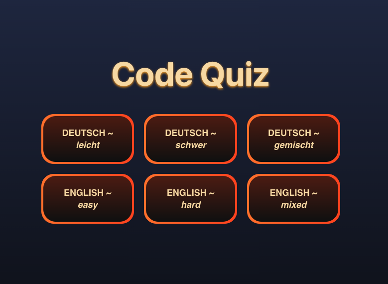
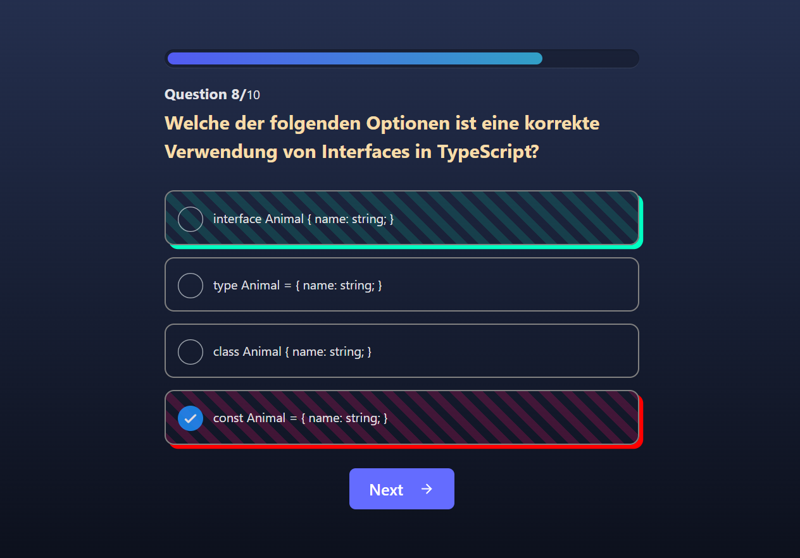

# Code Quiz 👩🏻‍💻

Welcome to Code Quiz, a TypeScript quiz application designed to test your knowledge with a plethora of questions. This interactive quiz offers several features to enhance your learning experience.

## Features

- Difficulty Selection: Choose between easy and hard levels.

- Language Selection: Switch between English and German.

- Sequential Questions: Answer one question at a time.

- Multiple Choice: Select one answer from four given options.

- Immediate Feedback: See instantly if your answer was correct or incorrect.

- Results Summary: View your overall score at the end of the quiz.

## Preview





## Navigation

Users can navigate through the quiz by using buttons to select the difficulty level and language preference. The quiz is designed to be intuitive, making it easy to switch settings and progress through questions.

## Technologies Used

- Vite: Fast and efficient build tool for modern web projects.

- HTML: Structure of the application.

- CSS: Styling for an engaging user interface.

- TypeScript: Type-safe scripting, enhancing JavaScript with additional features.

- Quiz API: Fetching quiz data dynamically.

## Design

The design was freely chosen to provide an engaging and interactive user experience.

## Team

This project was programmed by a team of two developers:

[[Mark](https://github.com/Mark1U)]

[[Sharon](https://github.com/sharonVko)]

## Getting Started

To get started with Code Quiz, follow these steps:

Clone the repository:

```
git clone git@github.com:Mark1U/ts-quiz.git
```

Navigate to the project directory:

```
cd ts-quiz
```

Install dependencies:

```
npm install
```

Run the development server:

```
npm run dev
```

## Contributing

Contributions are welcome! If you'd like to contribute to Code Quiz, please fork the repository, make your changes, and open a pull request.

## Live Demo

Check out the live demo on Netlify:[The Code Quiz on Netlify](https://the-code-quiz.netlify.app/)
